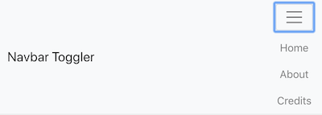

# React Navbar Toggler

A webapp example using:

- React
- React Router
- Bootstrap

with vanilla JS implementation for the Bootstrap Navbar Toggler



[Demo on Zeit](https://react-navbar-toggler.now.sh/)

# The Problem

We installed Bootstrap following the CRA [documentation](https://create-react-app.dev/docs/adding-bootstrap).

We want to use Boostrap's Navbar Toggler without having to install [React-bootstrap](https://react-bootstrap.github.io/), [Reactstrap](https://reactstrap.github.io/) or risking conflit installing JQuery in our React Webapp.

"React is unaware of changes made to the DOM outside of React. It determines updates based on its own internal representation, and if the same DOM nodes are manipulated by another library, React gets confused and has no way to recover."
[Integrating with DOM Manipulation Plugins](https://reactjs.org/docs/integrating-with-other-libraries.html)

## The Solution

We can reimplement the Navbar Toggler functionalities in our Navbar.js component


## Setup

Create a React app  
`npx create-react-app react-navbar-toggler`

Move into the project directory  
`cd react-navbar-toggler`

Install dependencies  
`yarn add node-sass bootstrap react-router-dom`

Create your project structure 

In your `Navbar.js` class component:

- Create a state in the constructor 

```jsx
    this.state = { collapsed: true };
```

- Create a function to update the state 

```jsx
    toggleNavbar = () => {
            this.setState(
                (prevState) => ({
                    collapsed: !prevState.collapsed
                })
            )
        }
```

- In the render assign the status to a variable

```jsx
const status = this.state.collapsed ? 'collapsed' : 'show';
```

- Assign the status and the function to your JSX

```jsx
<button onClick={this.toggleNavbar} className={`navbar-toggler navbar-toggler-right ${status}`} type="button" data-toggle="collapse" data-target="#navbarToggler" aria-controls="navbarToggler" aria-expanded="false" aria-label="Toggle navigation">
    <span className="navbar-toggler-icon"></span>
</button>
<div className={`collapse navbar-collapse ${status}`} id="navbarToggler">
...
</div>

```
## Reference

- https://reacttraining.com/react-router/
- https://create-react-app.dev/docs/adding-bootstrap/#using-a-custom-theme
- https://getbootstrap.com/docs/4.0/components/navbar/


Enjoy! 🥃


<hr>

This project was bootstrapped with [Create React App](https://github.com/facebook/create-react-app).

## Available Scripts

In the project directory, you can run:

### `yarn start`

Runs the app in the development mode.<br />
Open [http://localhost:3000](http://localhost:3000) to view it in the browser.

The page will reload if you make edits.<br />
You will also see any lint errors in the console.

### `yarn test`

Launches the test runner in the interactive watch mode.<br />
See the section about [running tests](https://facebook.github.io/create-react-app/docs/running-tests) for more information.

### `yarn build`

Builds the app for production to the `build` folder.<br />
It correctly bundles React in production mode and optimizes the build for the best performance.

The build is minified and the filenames include the hashes.<br />
Your app is ready to be deployed!

See the section about [deployment](https://facebook.github.io/create-react-app/docs/deployment) for more information.

### `yarn eject`

**Note: this is a one-way operation. Once you `eject`, you can’t go back!**

If you aren’t satisfied with the build tool and configuration choices, you can `eject` at any time. This command will remove the single build dependency from your project.

Instead, it will copy all the configuration files and the transitive dependencies (Webpack, Babel, ESLint, etc) right into your project so you have full control over them. All of the commands except `eject` will still work, but they will point to the copied scripts so you can tweak them. At this point you’re on your own.

You don’t have to ever use `eject`. The curated feature set is suitable for small and middle deployments, and you shouldn’t feel obligated to use this feature. However we understand that this tool wouldn’t be useful if you couldn’t customize it when you are ready for it.

## Learn More

You can learn more in the [Create React App documentation](https://facebook.github.io/create-react-app/docs/getting-started).

To learn React, check out the [React documentation](https://reactjs.org/).

### Code Splitting

This section has moved here: https://facebook.github.io/create-react-app/docs/code-splitting

### Analyzing the Bundle Size

This section has moved here: https://facebook.github.io/create-react-app/docs/analyzing-the-bundle-size

### Making a Progressive Web App

This section has moved here: https://facebook.github.io/create-react-app/docs/making-a-progressive-web-app

### Advanced Configuration

This section has moved here: https://facebook.github.io/create-react-app/docs/advanced-configuration

### Deployment

This section has moved here: https://facebook.github.io/create-react-app/docs/deployment

### `yarn build` fails to minify

This section has moved here: https://facebook.github.io/create-react-app/docs/troubleshooting#npm-run-build-fails-to-minify
